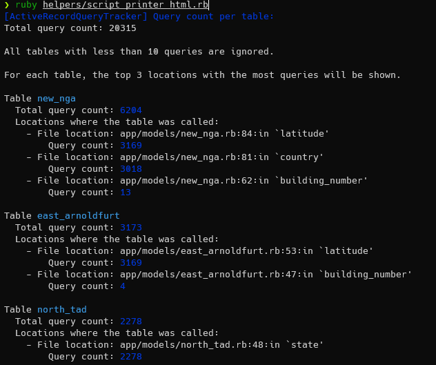
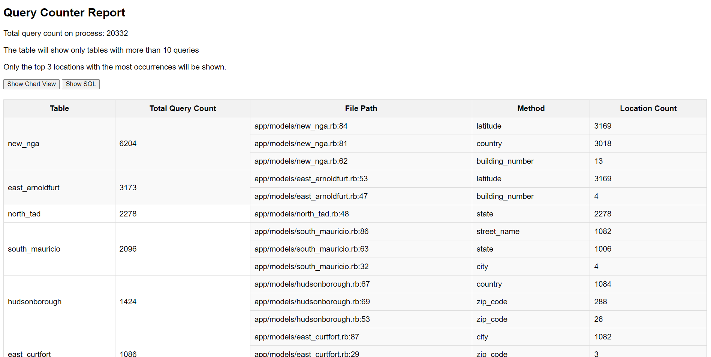

# ActiveRecordQueryCount

`ActiveRecordQueryCount` is a Ruby gem designed to help you track and analyze SQL queries executed by your ActiveRecord models. By subscribing to ActiveSupport notifications, it provides detailed insights into the queries being run, including the tables involved and the locations in your code where the queries are generated.
There are three things this gem allows you to do

1. You can compare two codes to view the difference in SQL counts on locations with a graph or a table.
2. You can view an overview of the SQL that a code does in a graph, a table or in the console.
3. (In progress) You can see an overview of the current request on a controller action

## Installation

Add this line to your application's Gemfile:

```ruby
gem 'active-record-query-count'
```

And then execute:

```bash
bundle install
```

Or install it yourself as:

```bash
gem install active-record-query-count
```

## Usage

There are four ways of using this gem:

1. With a block of code

```ruby
require 'active-record-query-count'
ActiveRecordQueryCount.start_with_block(printer: :html) do
    # your code goes here
end
```

this will open up a html table with the SQL stats of your code

2. Starting recording manually

```ruby
require 'active-record-query-count'

ActiveRecordQueryCount.start_recording
# your code goes here
ActiveRecordQueryCount.end_recording(printer: :html)
```

3. Comparing two blocks of code (only available for html printer)

```ruby
require 'active-record-query-count'
ActiveRecordQueryCount.compare do |bench|
    bench.code('script1') do
    end
    bench.code('script2') do
    end
    bench.compare!
end
```

this will open up a graph comparing the quantity of SQL of the two codes

4. (In progress) Enabling a middleware to see an overview of the current request SQL's in Rack Application.
    On `config/development.rb` or the initializer of the application.

```ruby
  config.after_initialize do
    ActiveRecordQueryCount.configure do |configuration|
      configuration.enable_middleware = true
    end
  end
```

### Printing options

There are two ways of displaying the collected queries data, `:console` and `:html`, to select one pass the printer argument to `start_with_block` o `end_recording` methods.

If you use `html` with WSL enviroment, you need to set on your enviroments variables the `WSL_DISTRIBUTION` that you are using, so the dependency Launchy work as expected.

### Configuration options

When visualizing the html table or the console output, tables with less than `ignore_table_count` will not be shown. Also, the ammount of locations to show is given by `max_locations_per_table`

```ruby
config.after_initialize do
    ActiveRecordQueryCount.configure do |configuration|
      configuration.ignore_table_count = 1
      configuration.max_locations_per_table = 4
    end
  end
end
```

## Examples of visualization

1. Console output
   
2. HTML output
   
3. Bar chart output
   

## Development

After checking out the repo, run `bin/setup` to install dependencies. Then, run `rake test` to run the tests.

To install this gem onto your local machine, run `bundle exec rake install`. To release a new version, update the version number in `version.rb`, and then run `bundle exec rake release`, which will create a git tag for the version, push git commits and the created tag, and push the `.gem` file to [rubygems.org](https://rubygems.org).

## Contributing

Bug reports and pull requests are welcome on GitHub at <https://github.com/[USERNAME]/active-record-query-count>. This project is intended to be a safe, welcoming space for collaboration, and contributors are expected to adhere to the [code of conduct](https://github.com/[USERNAME]/active-record-query-count/blob/master/CODE_OF_CONDUCT.md).

## License

The gem is available as open source under the terms of the [MIT License](https://opensource.org/licenses/MIT).

## Code of Conduct

Everyone interacting in the ActiveRecordQueryCount project's codebases, issue trackers, chat rooms and mailing lists is expected to follow the [code of conduct](https://github.com/[USERNAME]/active-record-query-count/blob/master/CODE_OF_CONDUCT.md).
